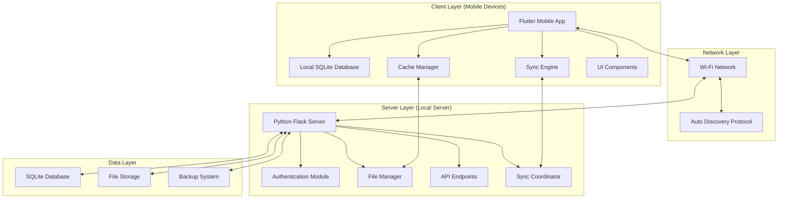
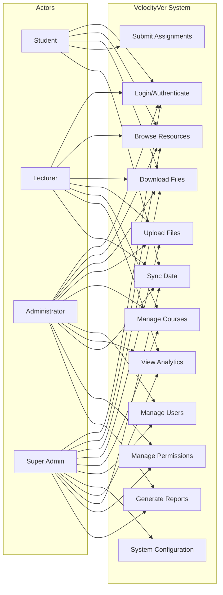
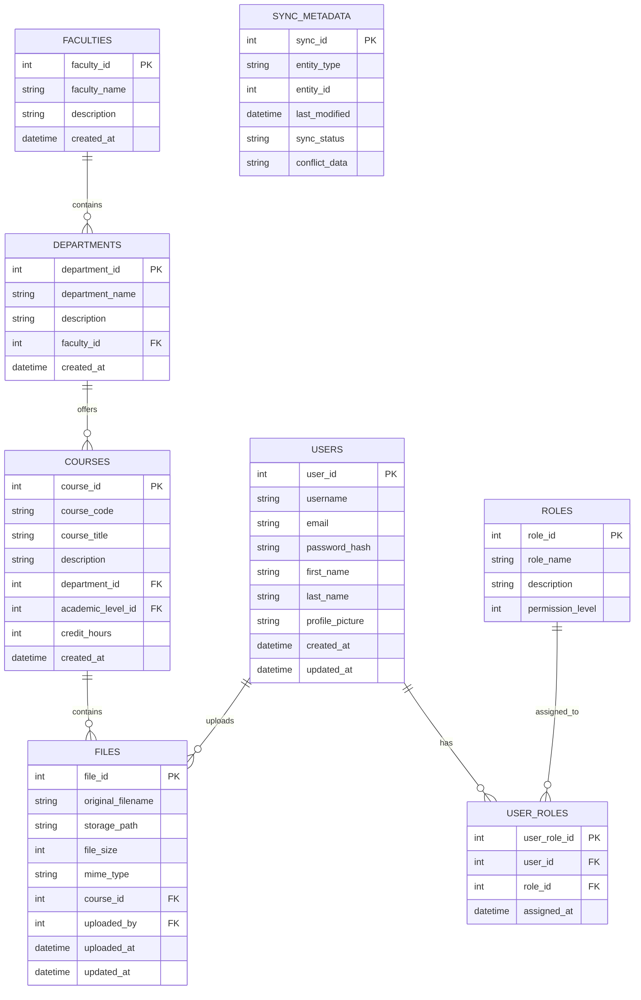
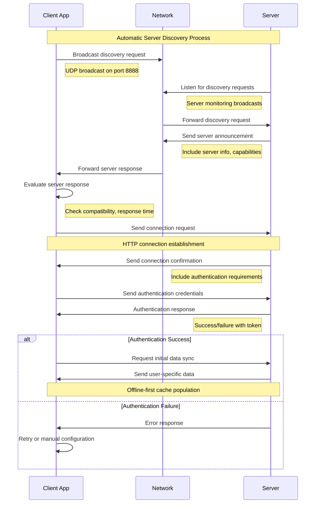
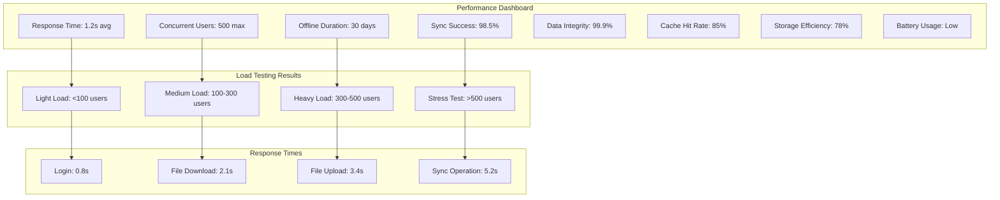

# VelocityVer Academic Report - Flowcharts and Diagrams

## Figure 3.1: System Architecture Diagram

## Figure 3.2: Use Case Diagram

## Figure 3.3: Database Entity Relationship Diagram

## Figure 4.7: Server Discovery Process Flow

## Figure 4.8: System Performance Metrics

